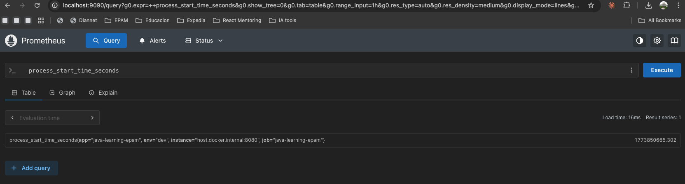

# Prometheus Monitoring — Cultural Events API

**Stack:** Spring Boot 4.0.3 · Java 21 · Micrometer · Prometheus
**Environment:** Local development (H2 in-memory, low traffic — academic exercise)

---

## What We Are Monitoring

Spring Boot exposes metrics through `/actuator/prometheus`, which Prometheus scrapes on a fixed interval (15 s in this setup). The metrics fall into two categories:

- **Custom metrics** — counters and timers defined in `EventMetricsService.java` tied to business events (event creation, deletion, login attempts)
- **Built-in metrics** — automatically registered by Micrometer: JVM memory, CPU, HTTP request latency, HikariCP connection pool, Flyway

---

## Screenshots

### 1. Events by Type — Counter Breakdown


**Query:**
```promql
sum by (type) (events_by_type_total)
```

Shows the total number of cultural events created, grouped by type (SPORTS, MUSIC, ART, THEATER, CAMPING). Each type is a separate counter registered at startup. Useful for understanding which categories are most active.

---

### 2. Events by Type — Raw Counter

%20(events_by_type_total).png)

**Query:**
```promql
events_by_type_total
```

Displays the raw counter value per `type` label without aggregation. Good for verifying individual counter registration and spotting label cardinality at a glance.

---

### 3. Total Login Attempts by Status


**Query:**
```promql
sum by (status) (auth_login_attempts_total)
```

Breaks down all login attempts into `success` and `failure`. Since the API uses stateless JWT, this is the primary way to observe authentication activity without server-side session tracking.

---

### 4. Login Brute-Force Signal


**Query:**
```promql
rate(auth_login_attempts_total{status="failure"}[1m]) * 60
```

Rate of failed login attempts per minute over a 1-minute sliding window. In production this query would back an alert rule — a spike here is the earliest signal of a credential-stuffing or brute-force attempt.

---

### 5. Average Request Latency


**Query:**
```promql
rate(events_service_duration_seconds_sum[5m])
  / rate(events_service_duration_seconds_count[5m])
```

Average duration (in seconds) of `CulturalEventService.findAll()` over a 5-minute window. Even in a low-traffic local environment this gives a baseline to compare against when the application scales or the dataset grows.

---

### 6. HTTP Request Rate (5-minute window)


**Query:**
```promql
rate(http_server_requests_seconds_count[5m])
```

Built-in Micrometer metric. Shows requests per second across all endpoints and HTTP status codes within a 5-minute rolling window. Useful for spotting traffic patterns and unexpected spikes.

---

### 7. Heap Space Usage (bytes)


**Query:**
```promql
jvm_memory_used_bytes{area="heap"}
```

Raw heap consumption in bytes. A steadily increasing line that never drops after GC is the classic sign of a memory leak.

---

### 8. Heap Usage Percentage


**Query:**
```promql
jvm_memory_used_bytes{area="heap"} / jvm_memory_max_bytes{area="heap"} * 100
```

Heap used as a percentage of the configured max (`-Xmx`). More actionable than raw bytes — easy to set an alert threshold (e.g., > 80 %).

---

### 9. CPU Usage


**Query:**
```promql
process_cpu_usage * 100
```

JVM process CPU utilization as a percentage. In a local development environment this stays near zero between requests, which is the expected baseline.

---

### 10. Process Start Time



**Query:**
```promql
process_start_time_seconds
```

Unix timestamp of when the JVM process started. Primarily used to detect unexpected restarts — if this value resets, the application was restarted.

---

## Conclusion

Even in a minimal local setup with almost no traffic, Spring Boot + Micrometer + Prometheus exposes a rich set of observability data with zero additional instrumentation beyond the actuator dependency. The custom metrics (`events_by_type_total`, `auth_login_attempts_total`, `events_service_duration_seconds`) demonstrate how business-level signals can sit alongside infrastructure metrics (JVM heap, CPU, HTTP latency) in a single scrape endpoint. In a production environment the same configuration — with real traffic and alert rules — would provide early warning for memory leaks, latency regressions, and security incidents.

---

## Additional Queries Worth Exploring

### HTTP & Endpoint Health

```promql
# Error rate (4xx + 5xx) across all endpoints
rate(http_server_requests_seconds_count{status=~"4..|5.."}[5m])

# p95 latency per endpoint
histogram_quantile(0.95,
  sum by (le, uri) (rate(http_server_requests_seconds_bucket[5m]))
)

# p99 latency (stricter SLO target)
histogram_quantile(0.99,
  sum by (le, uri) (rate(http_server_requests_seconds_bucket[5m]))
)

# Slowest endpoints ranked by average latency
sort_desc(
  rate(http_server_requests_seconds_sum[5m])
  / rate(http_server_requests_seconds_count[5m])
)
```

### JVM & Garbage Collection

```promql
# Non-heap memory (Metaspace, code cache)
jvm_memory_used_bytes{area="nonheap"}

# GC pause rate (collections per second)
rate(jvm_gc_pause_seconds_count[5m])

# GC pause total time per second (GC overhead)
rate(jvm_gc_pause_seconds_sum[5m])

# Live thread count
jvm_threads_live_threads

# Daemon vs non-daemon threads
jvm_threads_daemon_threads
```

### Database — HikariCP Connection Pool

```promql
# Active DB connections right now
hikaricp_connections_active

# Pending threads waiting for a connection
hikaricp_connections_pending

# Connection acquisition time p95
histogram_quantile(0.95,
  rate(hikaricp_connections_acquisition_seconds_bucket[5m])
)

# Connection timeout rate (exhausted pool signal)
rate(hikaricp_connections_timeout_total[5m])
```

### Application Availability

```promql
# Uptime derived from process start time
time() - process_start_time_seconds

# Flyway migrations that ran successfully
flyway_migrations_total{state="success"}

# Detect restarts: if this resets, the process restarted
process_start_time_seconds
```

### Security — Login Monitoring

```promql
# Login success ratio (0–1 scale)
auth_login_attempts_total{status="success"}
  / ignoring(status) sum(auth_login_attempts_total)

# Sustained failure rate over 5 minutes (alert candidate)
rate(auth_login_attempts_total{status="failure"}[5m]) > 0.1
```

### Events — Business KPIs

```promql
# Net events currently in DB vs ever created
events_total_in_db / events_created_total

# Deletion rate per minute
rate(events_deleted_total[5m]) * 60

# Most popular event type
topk(1, events_by_type_total)
```
